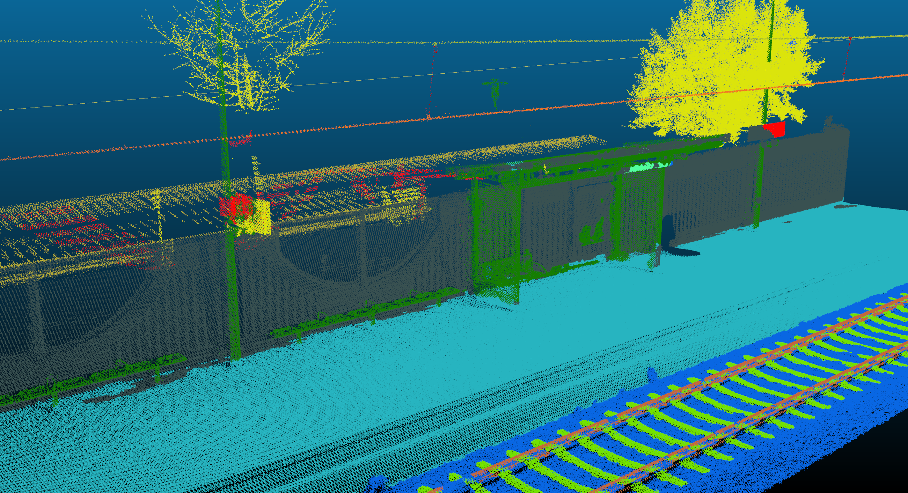

Modified by Felix Eickeler, Created by Hugues THOMAS, 

## Introduction

This is a modified version of the KPConv-Pytorch git repository [1], adapted to conduct experiments for the detection of railways.
We appreciate the effort and work that Thomas Hugues has put into the original project in code, help and documentation.<br/>
The git was used as detection component for the paper **Enhancing Railway Detection by Priming Neural Networks with Project Exaptations**. [2]


Mostly the modifications consist of 3 parts: 
- data + config loading
- custom training
- result writing

Most of the dataset splits and types can be change by modifying the import statements. 
Files are usually named rtib for dataset related tasks or RailTwin for generic use.

## Getting Started
Make sure that the common submodule is pulled:
```bash
git submodule init
git submodule update
```

This git is designed to be used in a docker and connected to over an ssh connection. The following command is recommended:
```bash
UUID="$(id -u)" GID="$(id -g)" SRC=</path/to/datafolder> docker-compose up kpconv -d
```
The building will take some time !

## Experiments

We are currently working on pubilshing the rtib+ dataset.
However the datasets given, are only partially available (see [2])

## Sources
[1] https://github.com/HuguesTHOMAS/KPConv-PyTorch

[2] https://www.mdpi.com/2072-4292/14/21/5482

